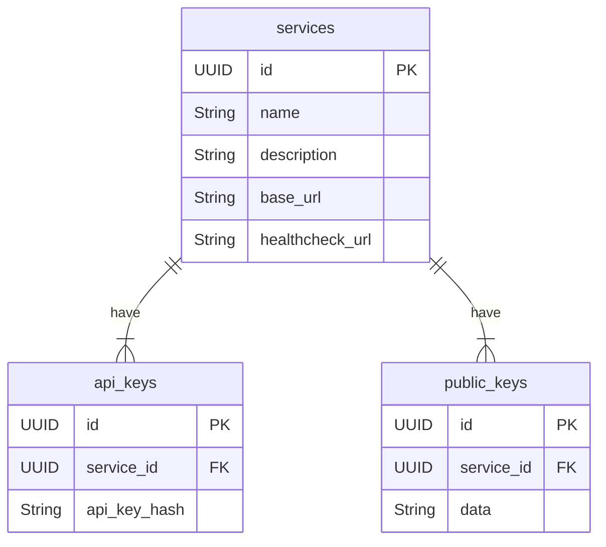

```mermaid
erDiagram

services {
    UUID id PK
    String name
    String description
    String base_url
    String healthcheck_url
}

api_keys {
    UUID id PK
    UUID service_id FK
    String api_key_hash
}

public_keys {
    UUID id PK
    UUID service_id FK
    String data
}

services ||--|{ api_keys : have
services ||--|{ public_keys : have

```
